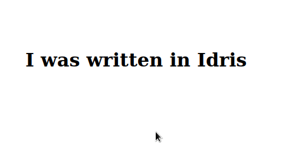

Idris Web Components
====================

A package for writing Custom Elements with Idris.

  - Easy composition of Custom Element functionality with support for
    do-notation, allowing for separation of concerns.

  - Proofs that storing a value as a string attribute and retrieving it again
    results in the same value.

  - The ability for one Custom Element to depend on the functionality of
    another. For example, if a parent relies on a child emitting an event,
    compilation will fail if the child does not declare that event.

[See it live](https://emccorson.github.io/idris-web-components)

Example
-------

```idris
main : IO ()
main = customElement "example-element" $

  do -- add a template with some styling
     Template
       """
       <style>
         :host([clicked]) { color: hotpink; }
       </style>
       <h1><slot></slot></h1>
       """

     -- add a boolean property 'clicked'
     -- this can be accessed in the browser with:
     --   document.querySelector('test-element').clicked
     -- we also get a getter and setter for use in Idris
     (getClicked, setClicked) <- Prop Bool "clicked"

     -- add a listener for the click event with a callback
     -- the callback sets our clicked property to true
     Listener "click" (\self, _ => setClicked True <*> pure self)
```

Now we compile the program to JavaScript (with `--codegen javascript`) and
include the output (along with `CustomElement/helper.js`) in an HTML file:

```
<html>
<head>
  <script src="out.js"></script>
  <script src="helper.js"></script>
<head>
<body>
  <example-element>I was written in Idris</example-element>
</body>
</html>
```


